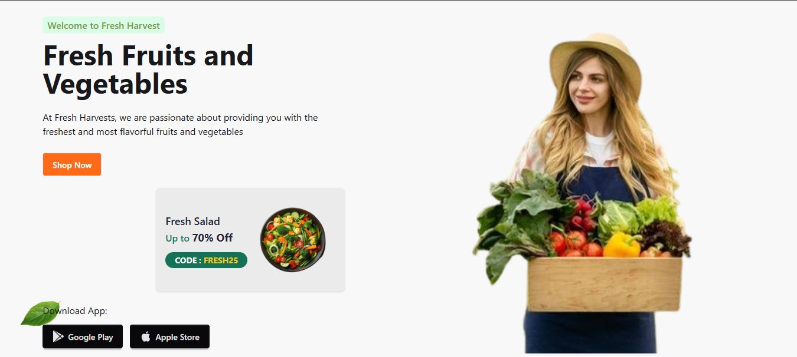
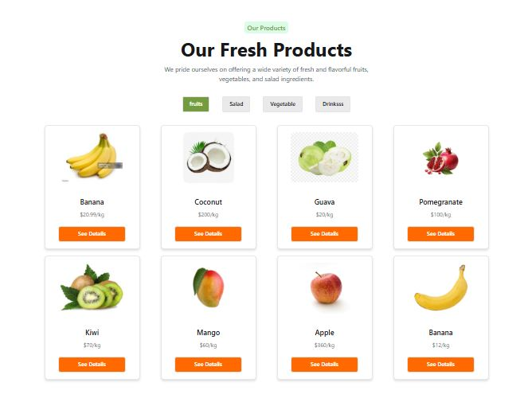
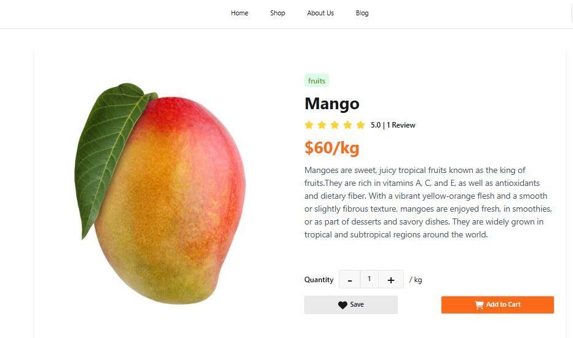
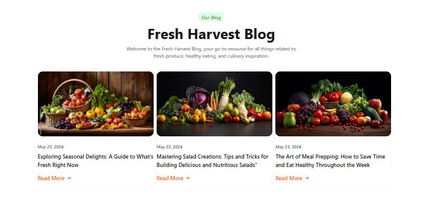
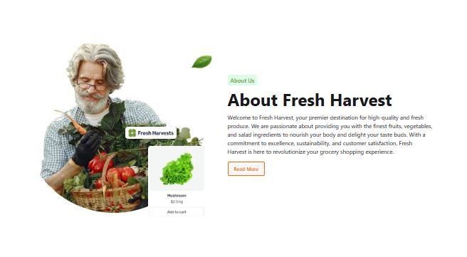

# 🥦 Fresh Harvests

**Fresh Harvests** is a modern web application built for a seamless and engaging online shopping experience, focusing on fresh produce and goods. The platform offers user authentication, product detail viewing, blog insights, and a functional add-to-cart system.

🔗 **Live Website:** [fresh-harvests-76edd.web.app](https://fresh-harvests-76edd.web.app/)  
📁 **GitHub Repository:** [github.com/Shifat507/fresh-harvests](https://github.com/Shifat507/fresh-harvests)

---

## 🚀 Features

- 🔐 **User Authentication**  
  Users can register and log in securely to access personalized features.

- 🛒 **Product Details**  
  View detailed information about each product including images, descriptions, and pricing.

- 📝 **Read Blogs**  
  Stay updated with fresh and insightful blog posts on healthy living and food tips.

- ➕ **Add to Cart**  
  Easily add your favorite items to the cart for a smooth shopping experience.

---

## 🖼️ Screenshots

> Include screenshots here to showcase your UI/UX.  
You can upload images in your GitHub repo and then link them here like so:

## 📸 Screenshots

### Hero

### Products

### Product Details

### Blogs

### About Us

